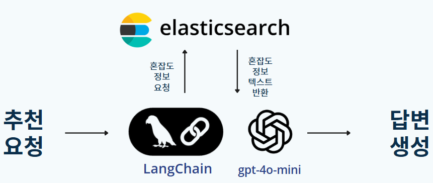

# 🧭 AiService_suggest - 개인 맞춤 관광지 추천

LangChain 기반 LLM 프롬프트를 활용하여  
사용자 성향 및 실시간 혼잡도 정보를 바탕으로 관광지를 추천하는 FastAPI 서버입니다.

---

## ✅ 주요 기능

- 성별, 나이, MBTI, 일정 등 사용자 정보 기반 추천
- 실시간 혼잡도 정보 필터링 (Elasticsearch) 검색 기반 정적 RAG 구조 사용
- LangChain + OpenAI 기반 프롬프트 구성


---

## ▶️ 실행 방법

1. 의존성 설치
```bash
pip install -r requirements.txt
```

2. 서버 실행
```bash
uvicorn app.main:app --reload
```

---

## 🔁 처리 과정

1. 사용자 입력값 수신 (일정, MBTI, 출발지 등)
2. 프롬프트 자동 생성
3. RAG 기반 검색 (Elasticsearch + FAISS)
4. LLM 응답 생성 및 추천 결과 반환

---

## 📋 여행 유형별 추천 기능 비교

| 여행 유형     | 설명                                                       | 사용자 입력 항목                             |
|--------------|------------------------------------------------------------|----------------------------------------------|
| **오늘 여행** | 당일 여행 추천. 혼잡도 정보를 반영해 실시간으로 덜 붐비는 장소 추천 | 출발 위치, 원하는 여행 스타일                |
| **일정 여행** | 1일 이상 여행 추천. 날짜 기반 맞춤 일정 제공               | 출발 위치, 원하는 여행 스타일                |
| **숙박 여행** | 1박 이상의 일정으로 구성된 숙박 기반 여행 추천             | 숙소 위치, 원하는 여행 스타일                |

---

## 📁 프로젝트 디렉토리 구조 (AiService_suggest)

```bash
AiService_suggest/
├── app/                         # 추천 기능을 위한 FastAPI 서버 구성
│   ├── chat_database.py        # 채팅 관련 DB 연결 설정
│   ├── chat_model.py           # 채팅 기록 데이터 모델
│   ├── createDB.py             # DB 초기 스키마 생성 스크립트
│   ├── es.py                   # Elasticsearch 연동 및 쿼리 처리 모듈
│   ├── router.py               # FastAPI 라우팅 설정
│   ├── schema.py               # 요청 및 응답을 위한 Pydantic 스키마 정의
│   ├── trip_recommender.py     # 여행지 추천 로직 구현
│   ├── user_database.py        # 사용자 관련 DB 설정
│   └── user_model.py           # 사용자 정보 데이터 모델
│
├── main.py                    # FastAPI 앱 실행 진입점
├── Dockerfile                 # Docker 빌드 설정
├── .dockerignore              # Docker 제외 파일 설정
├── .gitignore                 # Git 제외 파일 설정
├── requirements.txt           # 의존 패키지 리스트
```

---
